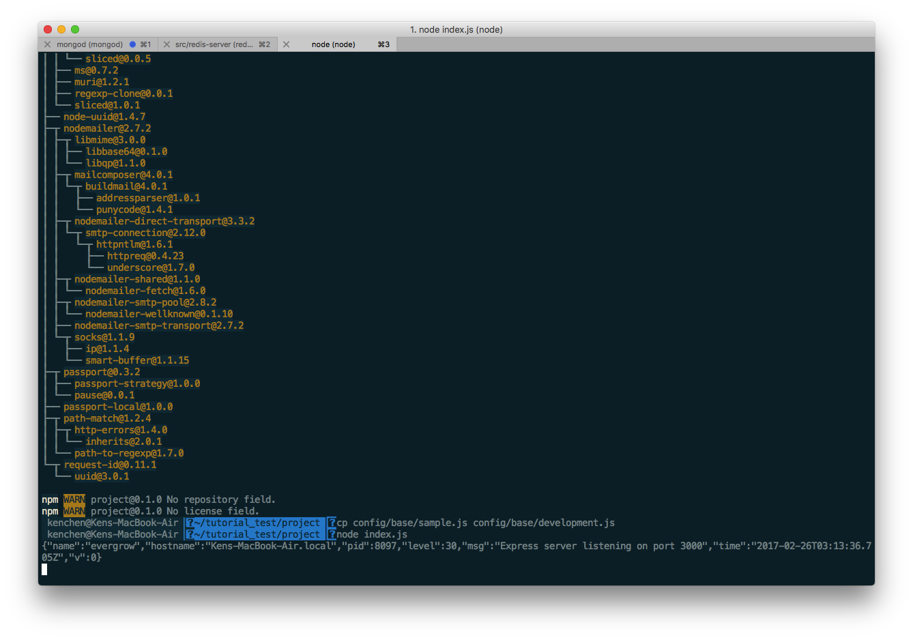

# Node.js 微信后台搭建系列 - Web App 骨架

什么是骨架呢？由于我出生在医生家族，所以第一个出现在脑海的东西还真的是人的骨架。不过，拿这个举例有点恐怖，也不太合适。所以，冒着被人误以为不是直男的风险，就拿 Barbie 娃娃来举例吧。  

一个什么都没有（当然还是穿了小内裤的）Barbie，可以比喻为一个骨架。虽然它什么都没有，但是它是一个完整的小人，可以活动，摆各种姿势。也就是，它的基本功能已经具备。在需要满足额外需求的时候，你可能只要买一些衣服，具体场景附属品就可以了。  

同样，一个 Web App 的骨架，具备连接数据库存取数据，用户注册登录，和后台管理系统的基本功能。当你想添加新模块和功能的时候，使用一些模板，参考已经有的功能，稍微做一些改动就可以了。  

本教程是通过 Yeoman 的一个脚手架 evergrow 来搭建 Web App 骨架的。以下是具体的步骤。  

## 搭建步骤

打开一个新的命令行窗口，并按顺序敲入下面的命令：

### 安装必备工具  

* 安装 Yeoman：  

  >npm install -g yo

* 安装脚手架 evergrow：  

  >npm install -g generator-evergrow

### 生成脚手架项目

* 新建一个目录作为今后的项目目录。  

**如果没有特殊说明，今后所有的命令行命令都应该在此项目目录下输入。**  

  >mkdir project

  >cd project

* 生成脚手架项目，默认敲 Enter 键两次就可以了

  >yo evergrow

### 安装依赖，配置并启动项目

* 下载安装项目依赖的工具（需要等一段时间）

  >npm install --registry=https://registry.npm.taobao.org

* 配置开发环境的参数

  >cp config/base/sample.js config/base/development.js

* 启动 MongoDB 和 Redis

  参考 [环境准备](./01-environment.md) 那一章，运行 `mongod` 和 `redis-server` 来启动两个服务。  

* 启动项目

  >node index.js

看到类似下面的提示，就表示项目启动成功了：  

## 访问并使用

* 在浏览器输入 `http://localhost:3000`

* 点击 Signup 注册并登录使用

就这么几步，你已经搭建好一个完整的 Node.js 后台了。  
